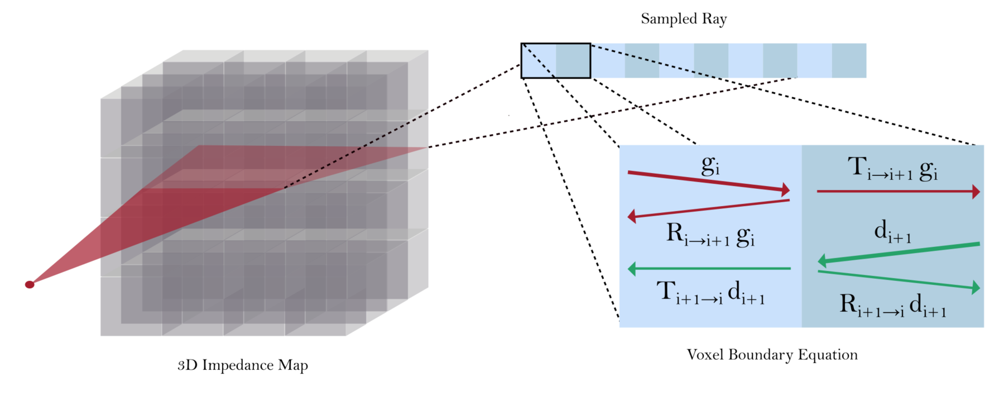
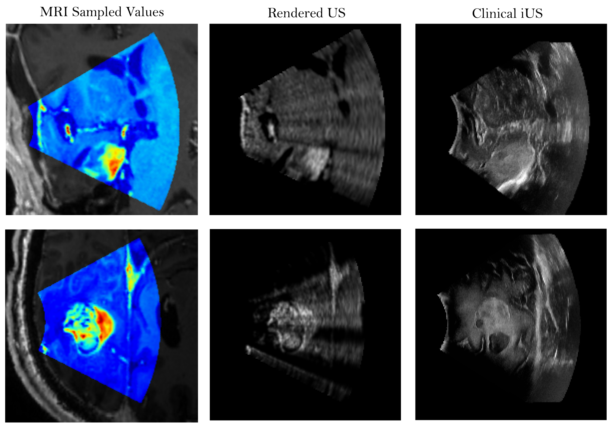

# DiffUS: Differentiable Ultrasound Rendering from Volumetric Imaging

[](https://github.com/gduguey/DiffUS)
[](LICENSE)

This repository contains the implementation of **DiffUS**, a physics-based, differentiable ultrasound renderer that generates realistic B-mode images from volumetric medical imaging data (MRI). DiffUS models acoustic wave propagation using coupled reflection-transmission equations and forms B-mode ultrasound images through a depth-resolved echo extraction procedure. It is fully implemented in PyTorch and supports gradient-based optimization for downstream tasks like image registration and reconstruction.

<p align="center">
  
</p>


## Overview

Intraoperative ultrasound (iUS) offers real-time guidance during surgery but suffers from artifacts and poor alignment with preoperative scans (like MRI). **DiffUS** bridges this gap by:
- Learning to map MRI intensities to acoustic impedance volumes.
- Simulating ultrasound propagation with ray tracing and a sparse linear wave system.
- Rendering fan-shaped B-mode images including realistic artifacts (speckle, depth blur).
- Supporting differentiable rendering for applications like MRI-to-US registration.

Features:
- **Differentiable Simulation**: Entirely implemented using PyTorch tensor operations.
- **Physics-Guided Rendering**: Based on reflection/transmission coefficients and time-of-flight.
- **Artifact Modeling**: Adds speckle noise and depth-dependent degradation.
- **Evaluation Ready**: Compatible with paired MRI/ultrasound datasets like [ReMIND](https://www.cancerimagingarchive.net/collection/remind/).

## Repository Structure

```

├── data/                  # One MRI and one iUS example
├── figs/                  # Visualizations used in the paper
├── notebooks/             # Example usage
├── src/                   # Core implementation
├── .gitignore
├── LICENSE
├── README.md
├── requirements.txt       # Required Python packages

````

## Getting Started

### 1. Install dependencies
```bash
conda create -n diffus python=3.10
conda activate diffus
pip install -r requirements.txt
````

### 2. Prepare volumetric data

Prepare MRI volumes in NIfTI (`.nii.gz`) format. See `notebooks/convert_to_impedance.ipynb` for impedance mapping.

### 3. Render ultrasound

Run the rendering notebook `python notebooks/render_slice.ipynb` specifying the path of your input.

## Results

We evaluate DiffUS on the [ReMIND dataset](https://www.cancerimagingarchive.net/collections/research/research-remind/), demonstrating anatomically faithful ultrasound images from MRI data. DiffUS recovers fine structures like ventricles and sulci and supports fast rendering (1–2 seconds per slice on GPU).

<p align="center">
  
</p>

<!-- ## Citation

If you use DiffUS in your work, please cite our paper:

```bibtex
@inproceedings{bertramo2025diffus,
  title     = {DiffUS: Differentiable Ultrasound Rendering from Volumetric Imaging},
  author    = {Noe Bertramo and Gabriel Duguey and Vivek Gopalakrishnan},
  booktitle = {Medical Image Computing and Computer-Assisted Intervention (MICCAI)},
  year      = {2025},
  note      = {To appear}
}
``` -->

## Authors

**Affiliation:** Massachusetts Institute of Technology (MIT) 

- **Noe Bertramo** – noe_bert@mit.edu  
- **Gabriel Duguey** – gduguey@mit.edu  
- **Vivek Gopalakrishnan** – vivekg@mit.edu  

## Acknowledgments

We thank Polina Golland, Reuben Dorent, Sandy Wells, and Karimi Davood for their valuable insights on ultrasound imaging and MRI data alignment.
