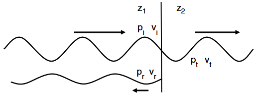
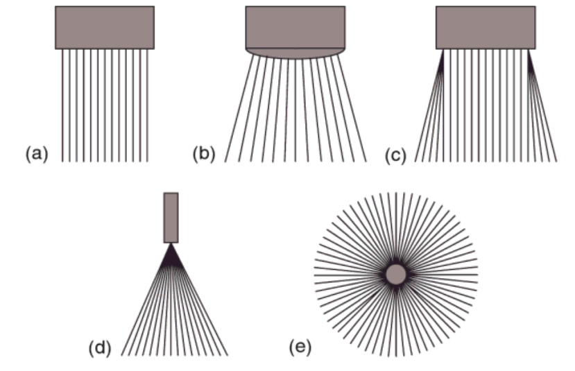

# Understanding US Physics

## US Wave Formation

Let's begin by discussing the domain of sound waves. Audible waves range from 20 Hz to 20 kHz. Ultrasound (US) refers to sound waves with frequencies above 20 kHz. In medical imaging, clinical ultrasound typically uses frequencies between 2 MHz and 15 MHz — far above audible sound. These high-frequency, low-wavelength waves allow for finer spatial resolution. The relationship between wave speed, frequency, and wavelength is given by:

$$c = f \lambda$$

In ultrasound echography:

- A <b>transducer</b> (or probe) emits a pulse of US waves into the body.
- The waves <b>reflect</b> off internal structures with different acoustic properties.
- The time delay and amplitude of the returned echoes are used to estimate the <b>depth and density</b> of tissues.

These waves propagate as pressure waves through the tissue. The equation above governs their behavior.

In biological tissues, we assume a <b>typical and constant</b> speed of sound around \(c = 1540 \, \text{m/s})\. To interpret echoes, we also need to understand the acoustic impedance of tissues. The acoustic impedance $Z$ characterizes how much resistance an ultrasound wave encounters as it passes through a medium and is defined as:

$$
Z = \rho c
$$

Where:
- \(\rho)\ is the tissue density in \(\text{kg/m}^3)\,
- \(c)\ is the speed of sound in that medium.

### Assumptions
For successful reconstruction of tissue structure, the following assumptions are made:

- (A) Sound travels in straight lines.
- (B) The speed of sound is uniform in all tissues.
- (C) A single pulse is emitted and received back at the transducer.
- (D) Attenuation of the wave is uniform throughout the medium.
- (E) Signals originate only from the main beam (not side lobes).

Most assumptions are reasonable. For example:
- (A), (C), and (E) follow from controlled probe design and beam focusing.
- (B) is supported by measurements showing that most soft tissues (excluding bone and air) have similar sound speeds, typically around 1540 m/s (Duck, 1990). This leads to the impedance being directly proportional to the tissue density.

Given these assumptions, if a pulse is emitted at time \(t_1)\ and an echo is received at time \(t_2)\, then the estimated depth \(d)\ of the reflecting interface is:

$$
d = \frac{c}{2} \times (t_2 - t_1)
$$

### Acoustic Impedance of Biological Tissues

Biological mediums can be seen as elements with acoustic impedance \(z=p/v)\ with \(p)\ local pressure waves and \(v)\ particle velocity, which is equivalent to \(z=\rho c)  where \(\rho)\ represents the density in \(kg\space  m^{-3})\ and \(c)\ is the velocity in the medium.

The table below represents some values of bodily acoustic impedance

| Tissue | Value [Rayls]  | 
| ------ | ------- |
| Bone  | $6.46\times 10^6$  |  
| Blood  | $1.67\times 10^6$  |  
| Liver  | $1.66\times 10^6$  |  
| Kidney  | $1.64\times 10^6$  |  
| Fat  | $1.33\times 10^6$  |  
| Air  | $430$  |  

_Table of acoustic values (Hoskins, ?)_

Apart from bones, most bodily tissues seem to share similar values of Impedance around \(1.6 \times 10^6)\.



To detect reflected waves, a change in medium (i.e., a discontinuity in impedance) is required. When a wave encounters such a boundary, the following conditions hold:

- The pressure and particle velocity must be continuous across the boundary.
- Assuming the same speed of sound across the boundary, the reflected pressure \(p_r)\ relates to the incident pressure \(p_i)\ by:

$$
\frac{p_r}{p_i} = \frac{Z_2 - Z_1}{Z_1 + Z_2}
$$

- The <b>reflected intensity ratio</b> (reflection coefficient) is:

$$
\frac{I_r}{I_i} = \left( \frac{Z_2 - Z_1}{Z_1 + Z_2} \right)^2 = R_a^2
$$

- The <b>transmitted intensity ratio</b> (transmission coefficient) is:

$$
1+ T_{1\rightarrow 2} = \frac{2 Z_2}{Z_2 + Z_1} 
$$


Where:
- \(Z_1, Z_2)\ are the acoustic impedances of the first and second media,
- \(I_i, I_r, I_t)\ are the incident, reflected, and transmitted wave intensities.
- \(R_a, T_{1\rightarrow 2})\ is the reflection coefficient of the physical component.


### In practice: transducer implementation

Let's look again at a pulse. Upon arrival at a frontier,  the two coefficients \(R_p)\ and \(T_p)\ from he previous section signalling reflection and transmission, are necessary to understand what is going on in detail. From the point of view of the transducer, the protocol is the following:

The transducer works as follows:
- Emits a short US pulse at a frequency \(f)\,
- For a time of \(T)\, listen to returned echoes:
    - Note arrival of waves at \(t_1,t_2,...t_k)\ and their amplitude \(a_1,a_2,...,a_k)\
    - For each \(t_i)\, compute existing distance \(d_i=\frac{c}{2}\times t_i)\
    - Impute the value of the corresponding pixel by $a_i$ the amplitude of the received wave.
    - Correct depth from attenuation of the waves

For instance, for an array of impedances of \([Z_1, Z_1, Z_1, Z_2, Z_2, Z_2, Z_2, Z_3, Z_3, Z_4])\
This yields a vector, corresponding to an array like \([0, 0, 0, a_1, 0, 0, 0, a_2, 0, a_3])\ corresponding to the different depths and corresponding amplitudes of the machine.


### B-Mode Imaging

B-mode (brightness mode) imaging is the most common ultrasound mode. It constructs 2D grayscale images by scanning multiple adjacent lines, where the brightness corresponds to echo amplitude.

Types of B-mode transducer formats:
- Linear
- Curvilinear
- Trapezoidal
- Radial


_Fig. 1 B-Mode transducer shapes (Diagnostic Ultrasound: Physics and Equipment Fig. 14)_


### M-Mode Imaging

M-mode (motion mode) captures a single scan line over time. It is ideal for visualizing moving structures (e.g., heart valves). The vertical axis represents depth, and the horizontal axis represents time.

### Doppler Imaging

Doppler ultrasound is used to measure blood flow velocity using the Doppler effect. The frequency shift $\Delta f$ between emitted and received signals reflects the relative motion of red blood cells:

$$
\Delta f \propto v \cos(\theta)
$$

Where $v$ is the velocity of blood and $\theta$ is the angle between the beam and the flow direction.

---

## MRI


**Magnetic Resonance Imaging (MRI)** creates detailed body images without ionizing radiation by combining three physical ingredients:

1. **Static magnetic field (B₀)** — aligns hydrogen‐nuclear spins; strength 1.5–7 T.
2. **Radio-frequency (RF) pulse** — tips the net magnetization into the transverse plane, producing a measurable signal.
3. **Gradient coils** — add small, position-dependent fields so frequency and phase encode spatial coordinates.

### Basic Sequence

| Step | What happens | Key symbol |
|------|--------------|------------|
| Align | Spins precess at Larmor frequency ω₀ = γB₀ | **M₀** |
| Excite | Short RF pulse flips magnetization | flip angle α |
| Encode | Gradients tag each location by phase/frequency | k-space |
| Acquire | Receiver coil records decaying echo (T₂\*, T₂) | **S(t)** |
| Reconstruct | Inverse Fourier Transform converts k-space → image | FFT |

### Image Contrast Controls
- **T₁-weighted:** short TR, short TE (fat bright, fluid dark).  
- **T₂-weighted:** long TR, long TE (fluid bright, pathology stands out).  
- **Diffusion / fMRI / spectroscopy** via specialized pulse trains.

### Summary Diagram

```text
   B₀ field  →  aligns spins (M₀)
        ↓
   RF pulse  →  tips M₀ into transverse plane
        ↓
   Gradients →  encode position in k-space
        ↓
   Receive    →  digitize signal    →  k-space
        ↓
   FFT        →  image with chosen contrast
```

---
## Aligning their physics

The MRI and US measure different physical quantities:
- MRIs render images by measuring alignement time of atoms
- US measures the density of matter

The difficulty thus is double:
- Match the two quantities of density to atomic realignement
- Implement a ray tracing algorithm to compute the phyiscal propagation of signals
