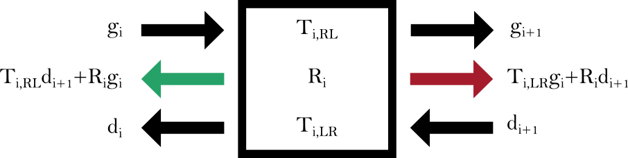

# Rendering Ultrasound from MRI — Differentiable and Physically Grounded

**Bertramo Noé, Duguey Gabriel — 6.8300 Final Project Blogpost**

---

## Introduction

> Can we simulate what a surgeon sees during an operation — just from an MRI taken before the procedure begins?

Ultrasound imaging is fast, safe, and real-time, making it indispensable during surgery. However, its images are often noisy, difficult to interpret, and poorly aligned with the high-resolution MRI (Magnetic Resonance Imaging) scans acquired pre-operatively. This disconnect poses a serious challenge during delicate procedures like tumor resection, where surgeons must mentally map unclear intraoperative ultrasound onto clearer MRI anatomy. Without accurate alignment between the two modalities, it becomes harder to localize critical structures, track residual tumor, or adapt the surgical plan on the fly.

In this project, we explore whether it is possible to bridge this gap by **rendering ultrasound-like images directly from MRI volumes**. Our approach relies on a **physics-informed, differentiable renderer** that mimics how acoustic waves propagate through tissue, reflect off boundaries, and attenuate with depth — capturing the key elements of B-mode ultrasound image formation.

By grounding the simulation in wave physics and acoustic impedance modeling, our method generates synthetic ultrasound images that qualitatively resemble those captured during surgery. Unlike black-box models, our renderer is **interpretable and fully differentiable**, allowing it to be integrated into larger machine learning pipelines — for example, to train models that align or register multimodal scans.

While the current work focuses on the forward rendering process and does not yet perform image alignment, it lays the foundation for future systems that could combine physical simulation with learning-based optimization to support real-time surgical guidance.

## Background and Related Work

Generating synthetic ultrasound from structural scans has been explored in the context of CT and X-ray imaging, where differences in modality are less pronounced. Differentiable rendering methods have been used for fast alignment in X-ray/CT registration tasks, and simulation of ultrasound from CT volumes has been shown to be feasible using simplified impedance models. In the case of MRI and US alignment, prior efforts have mainly relied on gradient-based similarity metrics, rigid registration based on echogenic anatomical landmarks, or probabilistic feature matching frameworks.

Despite progress, few methods account for the underlying wave propagation physics, particularly with respect to acoustic impedance changes in soft tissues. To our knowledge, no prior method combines MRI-to-US synthesis with differentiable physics-based rendering. This is the gap our work seeks to address.

Generating synthetic ultrasound from structural scans has been explored in the context of CT and X-ray imaging, where differences in modality are less pronounced [6]. Differentiable rendering methods have been used for fast alignment in X-ray/CT registration tasks [3,4], and simulation of ultrasound from CT volumes has been shown to be feasible using simplified impedance models [6]. In the case of MRI and US alignment, prior efforts have mainly relied on gradient-based similarity metrics [2], rigid registration based on echogenic anatomical landmarks [1], or probabilistic feature matching frameworks [1].

Despite progress, few methods account for the underlying wave propagation physics, particularly with respect to acoustic impedance changes in soft tissues. Moreover, most existing approaches are either non-differentiable or focused on structurally similar modalities [2]. To our knowledge, no prior method combines MRI-to-US synthesis with differentiable physics-based rendering. This is the gap our work seeks to address.

## Method

We implement a differentiable ultrasound renderer grounded in the physical principles of acoustic wave propagation. The renderer takes as input a volumetric MRI scan and a virtual transducer position and orientation, and outputs a 2D image mimicking B-mode ultrasound output. The core of this system rests on two components: a physical model of ultrasound wave behavior and a numerical engine for forward simulation of these waves through biological media.

### 1. Acoustic Principles of Ultrasound Imaging

Ultrasound waves are sound waves with frequencies above 20 kHz. In medical imaging, typical ranges span 2 MHz to 15 MHz. These high-frequency waves propagate as pressure waves through tissue. The propagation characteristics are determined by the speed of sound $ c $ and the acoustic impedance $ Z $ of the tissue:

$$
c = f \lambda \quad \text{and} \quad Z = \rho c
$$

where $ f $ is the wave frequency, $ \lambda $ the wavelength, and $ \rho $ the tissue density. 

**Acoustic impedance** is the key physical quantity governing ultrasound-tissue interaction. It governs how waves reflect and transmit at interfaces. When a wave encounters a boundary between two media with different impedances $ Z_1 $ and $ Z_2 $, the reflection and transmission are characterized by:

$$
R_{1 \rightarrow 2} = \frac{p_r}{p_i} = \frac{Z_2 - Z_1}{Z_1 + Z_2}, \quad T_{1 \rightarrow 2} = \frac{2 Z_2}{Z_2 + Z_1}
$$

where $ p_r $ and $ p_i $ are the reflected and incident pressure amplitudes, and $ R_{1 \rightarrow 2} $ and $ T_{1 \rightarrow 2} $ are respectively the reflexion and the transmission coefficients from medium 1 to medium 2.

To operate reliably and enable tractable simulation, modern ultrasound probes make several physical simplifications. These assumptions will also simplify our reasoning in the subsequent section on the forward simulation model:

- Sound travels in straight lines.
- Speed of sound is constant across soft tissues ($ c = 1540\,\text{m/s} $).
- A single pulse is emitted and received.
- Attenuation is uniform across media.
- Signal arises only from the main beam (no side lobes).

Under these assumptions, the depth of a reflecting structure can be inferred from the time it takes for the emitted wave to return to the transducer. If a pulse is sent at time $ t_1 $ and its echo is received at time $ t_2 $, the estimated depth $ d $ of the reflecting interface is:

$$
d = \frac{c}{2}(t_2 - t_1)
$$

This basic time-of-flight equation underlies the construction of A-mode and B-mode ultrasound images. In A-mode (amplitude mode), the returning echo amplitudes are plotted as a 1D signal along depth; in B-mode (brightness mode), multiple A-lines are combined into a 2D grayscale image where echo amplitude determines pixel brightness.

In practice, the amount of reflection at an interface depends on the contrast in acoustic impedance between adjacent tissues. Some typical impedance values are listed below:

| Tissue   | Impedance [Rayls]        |
|----------|--------------------------|
| Bone     | $6.46 \times 10^6$       |
| Liver    | $1.66 \times 10^6$       |
| Blood    | $1.67 \times 10^6$       |
| Fat      | $1.33 \times 10^6$       |
| Air      | $430$                    |

These values show that soft tissues have relatively similar impedances, leading to weak reflections, whereas large impedance gaps (e.g., between soft tissue and bone or air) cause strong reflections and shadowing.

### 2. Modeling Ultrasound Wave Propagation in Tissue

#### 2.1 From MRI to Acoustic Impedance

Although Magnetic Resonance Imaging (MRI) does not directly measure physical properties like density or acoustic impedance, MRI voxel intensities still reflect underlying tissue composition. Empirically, certain MRI sequences correlate with structural features — for example, higher signal intensities in T1-weighted scans often coincide with fatty or dense regions.

In our framework, we leverage this correlation by learning a mapping from MRI intensity to acoustic impedance values. This mapping is not hand-crafted but learned through a small neural network — specifically, a Multi-Layer Perceptron (MLP) trained on paired examples of MRI and known impedance profiles.

After this mapping is performed, we are given a 3D volumetric map of acoustic impedance values:

$$
Z(x, y, z)
$$

This volume is the basis for our simulation of ultrasound propagation.

#### 2.2 Ray-Based Forward Simulation

The goal of our renderer is to simulate what an ultrasound probe would measure when emitting a pulse from a given position and direction inside this volume. To do this, we treat each ultrasound beam as a **ray** that travels through a line of voxels, interacting with impedance boundaries along the way.

Each transition between two adjacent voxels is treated as a **material boundary**. When a wavefront reaches such a boundary, part of its energy is **reflected** and part is **transmitted**, depending on the difference in impedance between the two voxels.

This is illustrated in the schematic below:

Schematic of wave propagation across boundaries

We denote:
- $ g_i $: amplitude of the wave traveling forward (right) after the $ i $-th boundary
- $ d_i $: amplitude of the wave traveling backward (left) after the $ i $-th boundary

Each pair $ (g_i, d_i) $ represents the state of the wave at voxel $ i $. These values evolve recursively based on the following physical rules:

1. A forward wave $ g_i $ reaches the boundary at voxel $ i $ and generates:
   - A reflected backward wave contributing to $ d_{i} $
   - A transmitted forward wave contributing to $ g_{i+1} $
2. Similarly, a backward wave $ d_{i+1} $ arriving from the other side generates:
   - A reflected forward wave contributing to $ g_{i+1} $
   - A transmitted backward wave contributing to $ d_{i} $

These relations can be formalized by a system of equations involving the **reflection** and **transmission coefficients** between two media with impedances $ Z_i $ and $ Z_{i+1} $:

$$
\begin{aligned}
R_{i\rightarrow i+1} &= \frac{Z_{i+1} - Z_i}{Z_{i+1} + Z_i}, &
T_{i \rightarrow i+1} &= \frac{2 Z_{i+1}}{Z_{i+1} + Z_i} \\
R_{i+1\rightarrow i} &= -R_{i\rightarrow i+1}, &
T_{i+1 \rightarrow i} &= \frac{2 Z_i}{Z_{i+1} + Z_i}
\end{aligned}
$$

Given these coefficients, the forward and backward amplitudes at each interface evolve according to the following recurrence relations:

$$
\boxed{
\begin{aligned}
g_{i+1} &= T_{i \rightarrow i+1} \cdot g_i + R_{i+1\rightarrow i} \cdot d_{i+1} \\\\
d_i &= R_{i\rightarrow i+1} \cdot g_i + T_{i+1 \rightarrow i} \cdot d_{i+1}
\end{aligned}}
$$

These equations describe how the wave amplitudes at voxel $ i $ are determined by:
- The forward-traveling wave $ g_i $ that encounters the boundary between $ Z_i $ and $ Z_{i+1} $
- The backward-traveling wave $ d_{i+1} $ coming from the next voxel

The diagram below shows how these equations concretly work:

 

Recurrence relations for amplitude propagation

Each update step couples four unknowns: $ g_i, d_i, g_{i+1}, d_{i+1} $, and contributes two equations to the global system. By writing one such pair of equations for every boundary, we fully capture all internal reflections and transmissions across the layered medium.

#### 2.3 Matrix Formulation of the Forward Pass

To compute the resulting wave amplitudes efficiently, we arrange all unknowns into a single vector:

$$
x = \begin{bmatrix} g_0 & d_0 & g_1 & d_1 & \dots & g_N & d_N \end{bmatrix}^\top
$$

Each pair $ (g_i, d_i) $ represents the right- and left-traveling wave amplitudes in voxel $ i $, just after and before each boundary. For a system of $ N $ voxels, we model wave propagation across $ N $ boundaries, but we include $ N + 1 $ positions (from 0 to $ N $) to account for the injection point and the far-end termination. This yields $ 2(N+1) $ unknowns.

Each interface contributes a pair of equations describing how waves reflect and transmit across that boundary. These relations form a sparse linear system:

$$
A x = b
$$

For example, a simplified system with **3 voxels** (i.e., $ N = 3 $, 4 positions total) leads to 8 variables and the following matrix:

$$
\begin{pmatrix}
1 & 0       & 0       & 0       & 0       & 0       & 0       & 0 \\\\
-R_{10} & 1 & 0       & -T_{10} & 0       & 0       & 0       & 0 \\\\
-T_{01} & 0 & 1 & -R_{01} & 0       & 0       & 0       & 0 \\\\
0       & 0 & -R_{21} & 1 & 0       & -T_{21} & 0       & 0 \\\\
0       & 0 & -T_{12} & 0       & 1 & -R_{12} & 0       & 0 \\\\
0       & 0 & 0       & 0       & -R_{32} & 1 & 0       & -T_{32} \\\\
0       & 0 & 0       & 0       & -T_{23} & 0       & 1       & -R_{23} \\\\
0       & 0 & 0       & 0       & 0       & 0       & 0       & 1
\end{pmatrix}, \quad b = \begin{bmatrix}
1 \\\\ 0 \\\\ 0 \\\\ 0 \\\\ 0 \\\\ 0 \\\\ 0 \\\\ 0
\end{bmatrix}
$$

Here:
- The **first row** enforces the initial condition $ g_0 = 1 $, representing a unit pulse injected by the transducer.
- The **last row** sets $ d_N = 0 $, assuming no wave is entering the system from the far right — a standard boundary condition when the last layer is considered semi-infinite or non-reflective.
- The remaining rows model wave splitting at each boundary using the local reflection and transmission coefficients.

The resulting linear system is sparse and structured: each interface only affects the wave amplitudes in its immediate neighborhood. In other words, the amplitudes at position $ i $ only depend on what happens at positions $ i - 1 $, $ i $, and $ i + 1 $. This local connectivity makes the system fast to solve using standard numerical methods like forward-backward substitution, without needing to invert a large dense matrix.

#### 2.4 Pixel Value Extraction and Image Assembly

The quantity we ultimately care about — the one the ultrasound probe “sees” — is the **echo that returns to the transducer** after the wave has traveled through tissue and been reflected at various internal boundaries. Mathematically, this is the **backward-traveling amplitude** $ d_0 $ measured at the transducer location.

As the ultrasound wave travels deeper, it encounters more impedance changes and reflects multiple times. Each of these reflections returns to the transducer at a different time, and under our constant-speed assumption, **each arrival time corresponds directly to a specific depth**. This is how the probe reconstructs where, inside the body, the echoes originated.

To simulate this process, we take the following approach:

- We start by considering only the first voxel (layer of tissue). We build and solve the wave system for that single layer and record the reflected amplitude $ d_0^{(1)} $. This simulates the echo coming back from the **first depth step** (i.e., the earliest time after emission).
- Next, we include two voxels, allowing the wave to propagate deeper. We solve the system again and get a new amplitude $ d_0^{(2)} $, corresponding to the reflection at the **second depth**.
- We repeat this, progressively adding layers and solving a new system each time — always measuring the amplitude that returns to the transducer.

This cumulative simulation yields a **depth profile of reflected amplitudes** — one value per voxel depth — and mimics the sequence of echoes the transducer would receive over time. Because time and depth are directly related in ultrasound, we can interpret this profile as a vertical “column” in the final image: each value tells us how strongly the wave was reflected at that depth.

This process is illustrated below:

Sequential Ray Propagation

To build a full 2D image (a synthetic B-mode ultrasound scan), we repeat this procedure for many rays emitted at different angles from a single source. These rays fan out from a virtual transducer located at a 3D position $ (x, y, z) $ and pointing in a specific direction.

For each ray:
- We propagate through the tissue model as described above
- We store the full depth profile of returning amplitudes $ \{d_0^{(1)}, d_0^{(2)}, ..., d_0^{(N)}\} $
- This gives us one scanline of the image — a vertical slice showing reflectivity versus depth

Once all rays have been simulated, we stack their scanlines side-by-side in the order of their emission angles. The result is a complete fan-shaped grayscale image where pixel brightness corresponds to echo strength, and vertical position corresponds to tissue depth.

#### 2.5 Differentiability and Optimization

All components of the forward simulation — impedance calculation, wave reflection and transmission, matrix construction, and solution — are implemented using differentiable tensor operations in PyTorch. This allows end-to-end gradient flow through the ultrasound generation process, enabling integration with:

* Learning-based alignment models
* Registration pipelines
* Physics-informed loss functions

This differentiability is a key contribution of our method, distinguishing it from traditional simulators or precomputed rendering techniques.

#### 2.5 Replicating Ultrasound Artifacts

To make our simulated ultrasound images more realistic and clinically useful, we introduce post-processing artifacts that mimic common imperfections observed in real scans. These effects are essential to close the domain gap between simulated and real-world data, especially for applications in machine learning or image registration.

Real ultrasound images are shaped not only by the physics of wave propagation, but also by how energy is scattered, attenuated, and measured. Our synthetic images therefore include the following artifact layers:

- **Speckle noise**: This is a granular, interference-like pattern that arises from the coherent nature of ultrasound reflections within heterogeneous tissue. We model it as multiplicative noise that increases with depth, using two components:
  - A **radial component** introduces arc-like distortions along the direction of propagation. Its intensity increases with depth following a power law.
  - A **local grain component** adds high-frequency texture that mimics fine tissue heterogeneity. Its amplitude also scales with depth, making the noise coarser in deeper regions.

- **Depth-dependent attenuation and blur**: As waves penetrate deeper, they lose energy and the beam spreads laterally. We model this by applying a **Gaussian blur** across rays (i.e., laterally) with a standard deviation that increases linearly with depth.

These artifact layers are applied as optional and tunable post-processing steps. The combination of physically inspired simulation and perceptually accurate distortion helps produce images that are visually and statistically closer to real B-mode scans.

## Results

We evaluate our method using the ReMIND2Reg dataset, which provides paired 3D MRIs and intraoperative ultrasound scans from 102 neurosurgical patients. While the dataset includes both modalities, it does not provide explicit registration between the MRI volumes and the post-resection ultrasound acquisitions. As confirmed by one of the dataset creators, ground truth alignments are not available for post-resection US, making precise spatial correspondence unknown.

Because the ultrasound probe's position and orientation are not recorded, we manually estimated plausible source locations and directions based on anatomical landmarks and ultrasound coverage patterns. From these approximated configurations, we rendered synthetic ultrasound images using our differentiable forward model.

The evaluation presented here is thus qualitative. For selected cases, we visually compare the synthetic images to the corresponding real intraoperative ultrasound slices. 

While we cannot provide exact numerical validation without ground truth registration, these comparisons demonstrate the plausibility and visual fidelity of the synthetic output.

⬇️ _[Insert comparison figure: real vs rendered US]_  

<!--In addition to qualitative visual inspection, we measured runtime and memory usage of the renderer on standard CPU hardware. The full forward simulation for a single B-mode slice completes in under one second on a modern laptop, and the method requires only tens of megabytes of memory per ray bundle. These characteristics suggest that the approach is scalable and could support near-real-time rendering for surgical assistance or machine learning tasks.-->

## Discussion and Limitations

Our renderer demonstrates that ultrasound-like images can be synthesized from MRI data using simple physical models and differentiable operations. This provides a foundation for learning-based multimodal registration frameworks that integrate image formation into the alignment process.

Several limitations remain. The use of MRI intensity as a proxy for acoustic impedance is a strong approximation that may not generalize across anatomical regions. Our renderer does not account for complex wave phenomena such as scattering, refraction, or multi-path echoes. In addition, our current validation is qualitative, and integration with real-time surgical systems would require further engineering and clinical validation.

Despite these limitations, the method serves as a promising step toward fully differentiable multimodal registration in medical imaging.

## Conclusion

We presented a differentiable ultrasound renderer that synthesizes realistic B-mode images directly from MRI volumes. By modeling acoustic wave propagation through tissue layers and leveraging simple assumptions about wave speed, impedance, and reflection, the method produces structured, interpretable outputs without relying on data-driven black boxes.

Our renderer is fully differentiable — enabling integration into larger machine learning pipelines for tasks such as multimodal image registration and surgical navigation. Despite the lack of ground truth alignment in the ReMIND2Reg dataset, our qualitative results show encouraging visual similarity between real and rendered ultrasound scans.

Future work will focus on improving realism through better MRI-to-impedance mappings, and integrating the renderer into end-to-end trainable systems for multimodal alignement and real-time intraoperative assistance.

---

## References

\[1] Coupé, P., Hellier, P., Morandi, X., & Barillot, C. (2012). 3D rigid registration of intraoperative ultrasound and preoperative MR brain images based on hyperechogenic structures. *International Journal of Biomedical Imaging*, 2012.

\[2] Fuerst, B., Wein, W., Müller, M., & Navab, N. (2014). Automatic ultrasound–MRI registration for neurosurgery using the 2D and 3D LC2 metric. *Medical Image Analysis*, 18(8), 1312–1319.

\[3] Gopalakrishnan, V., & Golland, P. (2022). Fast auto-differentiable digitally reconstructed radiographs for solving inverse problems in intraoperative imaging. *Workshop on Clinical Image-Based Procedures*.

\[4] Gopalakrishnan, V., Dey, N., & Golland, P. (2024). Intraoperative 2D/3D image registration via differentiable X-ray rendering. *CVPR 2024*.

\[5] Juvekar, P., et al. (2023). The brain resection multimodal imaging database (ReMIND). [https://doi.org/10.7937/3RAG-D070](https://doi.org/10.7937/3RAG-D070)

\[6] Nasser, S. A. & Sethi, A. (2023). Simulating ultrasound images from CT scans. *medRxiv*, 2023.
