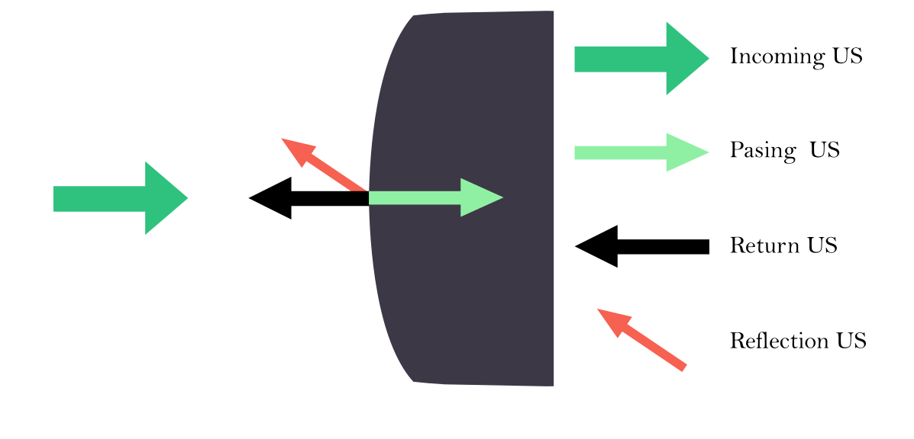
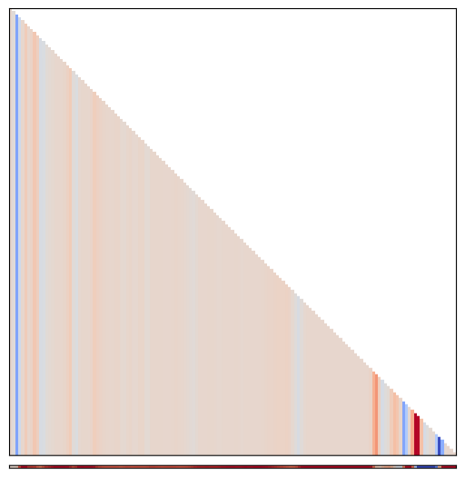

# Modeling the forward process of wave propagation in the acoustic mediums

## Theoretical Basis

We have seen previously the physical basis for wave propagation between two medium, with a change in pressure waves at a boundary translating into variations in the impedances, and thus the apparition of non-zero reflection coefficients, and non-one transmission coefficients

Looking at the following diagram, we can be reminded of the changes at a boundary $i$. For our context, we will consider that each voxel boundary is a medium change. In the coming text, we will consider that a switch from a cell \(i)\ to a following cell i+1 is a boundary \(i)\. This will be important in modeling the forward process.

Intuitively, there are exponentially many constraints on the transmission as every boundary change causes a change in reflected/transmitted change, and should thus influence all of the other reflections and transmissions further down the chain. A first simulation would thus have a ray propagating, reflecting, transmitting and a counter recording the "time of return": this is what actually happens in a transducer. Since we consider that speed is constant within the body, we can instead change the prism a bit to the following paradigm: by recording the amplitude of the wave in cell \(i)\, we can use that as the sound wave received from the reflection at boundary \(i)\.

<!-- Cumulative products of the waves,so that received wave at --> 

## Technical considerations

If we arrange the unknowns as  

\[
x=\bigl[g_0,\;d_0,\;g_1,\;d_1,\;\dots,\;g_N,\;d_N\bigr]^{\!\top},
\]

every pair of relations contributes a **\(2\times2\) block** on the main diagonal of a sparse
\(2(N+1)\times2(N+1)\) system \(A\,x=b\):

\[
A=\begin{pmatrix}
\boxed{\;1\;} &        &        &        &          &        \\
-\!R_{10} & \boxed{1} &        & -T_{10} &          &        \\
-\!T_{01} &        & \boxed{1} & -R_{01} &          &        \\
          &        &-\!R_{21}  & \boxed{1} &        & -T_{21}\\
          &        &-\!T_{12}  &        & \boxed{1} & -R_{12}\\
          &        &        &        &          & \boxed{1}
\end{pmatrix},
\qquad
b=\begin{pmatrix}1\\0\\0\\\vdots\\0\end{pmatrix}.
\]

*(The boxed 1 ’s are the \(+g_{i+1}\) or \(+d_i\) terms; the missing entries are zeros.)*  
Because the matrix is **block-tridiagonal**, it can be solved efficiently by forward/backward
substitution, but any dense solver will also work for small \(N\).

We obtain an solution correspondin to the following image:

---

### Worked example: **two interfaces, three media**

Let the acoustic impedances be  

\[
Z_0=1,\qquad Z_1=2,\qquad Z_2=1.5\;.
\]

Using

\[
\begin{aligned}
R_{i,i+1} &=\frac{Z_{i+1}-Z_i}{Z_{i+1}+Z_i},
& T_{i\rightarrow i+1}&=\frac{2\,Z_{i+1}}{Z_{i+1}+Z_i},\\[6pt]
R_{i+1,i} &=-R_{i,i+1}\,\frac{Z_i}{Z_{i+1}},
& T_{i+1\rightarrow i}&=\frac{2\,Z_{i}}{Z_{i+1}+Z_i},
\end{aligned}
\]

we obtain

| interface | \(R_{\,LR}\) | \(R_{RL}\) | \(T_{\,LR}\) | \(T_{RL}\) |
|-----------|-------------|-----------|--------------|-------------|
| 0–1 | \(+\tfrac13\) | \(-\tfrac16\) | \(\tfrac{4}{3}\) | \(\tfrac23\) |
| 1–2 | \(-\tfrac{1}{7}\) | \(+\tfrac{2}{21}\) | \(\tfrac{6}{7}\) | \(\tfrac{8}{7}\) |

Plugging those numbers into the matrix above and solving \(A x = b\) gives

\[
x=\bigl[\,g_0=1,\;d_0=0.0141,\;g_1=1.424,\;d_1=0.271,\;g_2=1.220,\;d_2=0\bigr]^{\!\top}.
\]

Hence, after all multiple internal reflections:

* **\(1.4\)×** the incident amplitude is propagating just beyond the first interface,
* only **1.4 %** of the drive is reflected back to the source,
* and nothing is incident from the far right, as enforced by \(d_2=0\).

This compact matrix formalism generalises immediately to any number of interfaces and is the backbone of the numerical propagation routine used in the code.
$$\begin{bmatrix}a & b \\ c & d\end{bmatrix}$$

Inversing leads us to identify the $g$, $d$ corresponding to the left traveling and right traveling amplitudes of waves.

## One row examples

As we add more than two interfaces, the paradigm has to shift a little. Since we are trying to render propagation, we need rays to return to the source transducer. This means that we need to solve the above system N times with 
\([g_i]_{i\in[1,N]})\in order to propagate back for every successive ray. Thus, in order to get the $i-th$ pixel, we need to solve the system with \([Z_l]_{l\leq i})\ and fetch \(d_0)\ the return value of the ray reflected from this pixel. The graphic below shows an example of propagation and the ensuing results.

We batch this to process rows efficiently. In order to position an ultrasound, we need an original position \((x,y,z))\ and an orientation from which to propagat the rays. We plot the results in a fan shapee to display ultrasounds.

## Artifact Replication

Final step
<!-- Gabi?>
